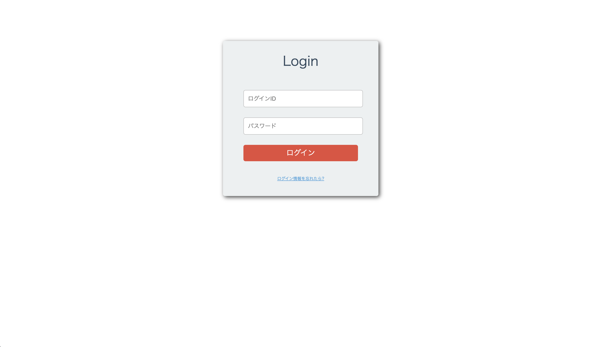

# rails-simple-login
Ruby on Rails6.1系で作成されたシンプルなログイン認証機能

### ログイン画面


### Welcome画面


## Ruby バージョン
* 2.6.0

## Railsバージョン
* 6.1.4

## 静的コードチェックコマンド

```
bundle exec rubocop
```

## Rspecテストコマンド

```
bundle exec rspec
```

## データベース生成コマンド

```
budnle exec rails db:create
```

## マイグレーションの実行コマンド

```
bundle exec rails db:migrate
```

## Seedデータの投入コマンド

```
bundle exec rails db:seed
```

## アプリケーションの起動コマンド

```
bundle exec rails s
```

## アプリケーションへのアクセスURL

```
http://localhost:3000/
```
